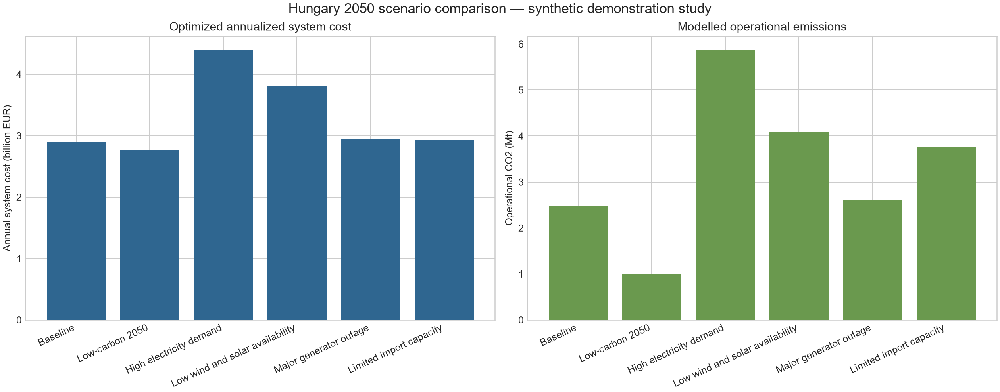

# Hungary 2050 Power System Planner

[](https://github.com/abdulrahmancoding/hungary-2050-power-system-planner/actions/workflows/tests.yml)
[](https://www.python.org/)
[](https://pypsa.org/)
[](LICENSE)

A transparent, reproducible capacity expansion and hourly dispatch study for a
stylized Hungary 2050 electricity system. It demonstrates the numerical ideas
behind long-term power-system planning: investment, dispatch, storage,
operational emissions, imports, renewable curtailment, reliability, and stress
testing.

> **Scope:** this is an educational demonstration, not an official forecast or
> policy recommendation. The hourly input is deterministic and synthetic. Every
> capacity, cost, limit, and scenario setting is a modelling assumption unless
> explicitly identified as source-derived in [SOURCES.md](SOURCES.md).

## Author

**Abdul Rahman Khaldoun Hasan Abuzeid**

BSc Computer Science Engineering student at Budapest University of Technology
and Economics (BME), specializing in Infocommunication.

This project was developed as a technical portfolio study. The author does not
claim prior professional energy-sector experience.

## What the model does

Hungary is represented by one electricity node over 8,760 consecutive hourly
snapshots. PyPSA formulates a linear program and HiGHS solves generation and
battery dispatch while co-optimizing allowed solar, wind, gas, and battery
capacity. Nuclear and import capacity are fixed by default. A high-cost
load-shedding generator preserves feasibility and measures energy not served.

The repository runs six YAML-defined scenarios:

| Scenario | Change from shared assumptions | Question tested |
|---|---|---|
| Baseline | None | What is the reference least cost mix? |
| Low-carbon 2050 | 1 Mt operational CO2 cap; higher renewable/storage limits | How does a binding emissions budget change investment and dispatch? |
| High electricity demand | Demand +30% | Can the allowed system serve strong electrification? |
| Low wind and solar availability | Both capacity-factor series -35% | How sensitive is planning to a uniform renewable-resource stress? |
| Major generator outage | 75% nuclear outage for two winter weeks | Can the system ride through a large generator outage? |
| Limited import capacity | Import limit reduced from 3.5 GW to 1 GW | What does reduced interconnection do to cost and reliability? |

The climate-stress case is deliberately simple: it applies a uniform derating,
not a downscaled climate projection.

## Verified demonstration results

These values are outputs from the committed synthetic dataset and assumptions,
not predictions. All six solves returned `ok / optimal` with PyPSA 1.2.4 and
HiGHS 1.15.1 on 2026-08-13.

| Scenario | Annualized cost (EUR bn) | Operational CO2 (Mt) | Imports (TWh) | Unserved energy (MWh) |
|---|---:|---:|---:|---:|
| Baseline | 2.900 | 2.478 | 12.913 | 0.000 |
| Low-carbon 2050 | 2.774 | 1.000 | 5.537 | 0.000 |
| High electricity demand | 4.395 | 5.869 | 20.680 | 175.820 |
| Low wind and solar availability | 3.807 | 4.085 | 19.621 | 0.000 |
| Major generator outage | 2.941 | 2.600 | 13.201 | 0.000 |
| Limited import capacity | 2.935 | 3.764 | 5.939 | 68.771 |

The low-carbon case costing less than the baseline is a consequence of the
assumed technology costs, expanded wind potential, perfect foresight, and fixed
import price—not evidence that real-world decarbonization is cost-free. The
small reliability shortfalls in two stress cases occur at the imposed capacity
limits and are intentionally reported rather than rounded away.



Additional committed figures cover the [capacity mix](results/figures/capacity_mix.png),
[generation mix](results/figures/generation_mix.png), and
[security and flexibility indicators](results/figures/security_and_flexibility.png).
The complete comparison table is
[`results/tables/scenario_comparison.csv`](results/tables/scenario_comparison.csv).

## Mathematical formulation

The decision variables are installed power capacities `G_s`, hourly generation
`g_(s,t)`, battery charge/discharge, and battery state of charge. In simplified
form, the objective is:

```text
min  sum_s(capital_cost_s * G_s)
   + sum_t sum_s(weight_t * marginal_cost_s * g_(s,t))
```

subject to these principal constraints:

```text
electricity balance:
demand_t + battery_charge_t
  = sum_s(g_(s,t)) + battery_discharge_t

available generation:
0 <= g_(s,t) <= capacity_factor_(s,t) * G_s

capacity expansion bounds:
existing_capacity_s <= G_s <= maximum_capacity_s

battery energy balance:
soc_t = (1 - standing_loss) * soc_(t-1)
        + eta_charge * charge_t
        - discharge_t / eta_discharge

battery limits:
0 <= charge_t, discharge_t <= G_battery
0 <= soc_t <= duration_hours * G_battery

optional emissions budget:
sum_t sum_f(g_(f,t) * emission_factor_f / efficiency_f) <= CO2_cap
```

The battery is cyclic: end-of-year state of charge equals beginning-of-year
state of charge. Renewable curtailment is available solar/wind energy minus
actual solar/wind dispatch. Imports are a dispatchable external supply with a
fixed capacity, price, and assumed emissions intensity. Load shedding has a
10,000 EUR/MWh penalty; its dispatch is the unserved-energy metric.

## Reproduce on Windows PowerShell

Prerequisites: Python 3.11-3.13 and Git. A separate HiGHS executable is not
needed because the pinned `highspy` wheel provides the solver interface.

```powershell
git clone https://github.com/abdulrahmancoding/hungary-2050-power-system-planner.git
Set-Location "hungary-2050-power-system-planner"
python -m venv .venv
.\.venv\Scripts\python.exe -m pip install --upgrade pip
.\.venv\Scripts\python.exe -m pip install -e ".[dev]"
.\.venv\Scripts\python.exe -m pip check
.\.venv\Scripts\python.exe -m hungary2050 prepare-data
.\.venv\Scripts\python.exe -m pytest -q
.\.venv\Scripts\python.exe -m hungary2050 run-all
```

Run one scenario or a short diagnostic period:

```powershell
.\.venv\Scripts\python.exe -m hungary2050 run scenarios\05_major_outage.yaml
.\.venv\Scripts\python.exe -m hungary2050 run scenarios\01_baseline.yaml --hours 48
```

`--hours` is for development and tests only; annualized investment costs are
not rescaled for a truncated horizon, so short-run economics are not comparable
with the full-year results.

## Repository map

```text
src/hungary2050/       typed package: config, data, model, results, CLI
scenarios/             shared assumptions plus six YAML cases
data/processed/        committed reproducible 8,760-hour synthetic CSV
data/raw/              placeholder for optional future source extracts
tests/                 validation, loading, construction, solve, accounting
results/tables/        JSON/CSV summaries and hourly dispatch by scenario
results/figures/       reproducible cross-scenario charts
.github/workflows/     Linux CI for install, data determinism, and tests
```

## Interpretation and limitations

The project demonstrates engineering practice and optimization literacy; it
does not claim professional energy-sector experience. Major limitations are:

- a one-node copper-plate system with no Hungarian transmission constraints;
- synthetic demand and renewable profiles with one deterministic weather year;
- perfect foresight and a linear relaxation, without unit commitment, reserves,
  ramping, inertia, grid stability, or N-1 network security;
- fixed four-hour battery duration and no hydro, biomass, demand response,
  sector coupling, transmission expansion, or endogenous import price;
- annualized assumed costs without detailed financing, construction pathways,
  taxes, market design, or multi-year investment chronology;
- operational CO2 only; no lifecycle or upstream emissions;
- outage and climate sensitivities are scenario stresses, not probabilistic
  reliability or climate-risk assessments.

See [ASSUMPTIONS.md](ASSUMPTIONS.md) for the full value register and
[SOURCES.md](SOURCES.md) for direct links, fields, transformations, licenses,
and limitations. Contributions are described in [CONTRIBUTING.md](CONTRIBUTING.md).
